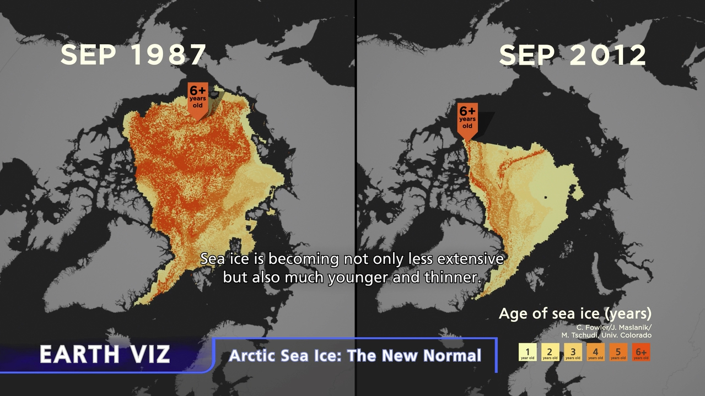
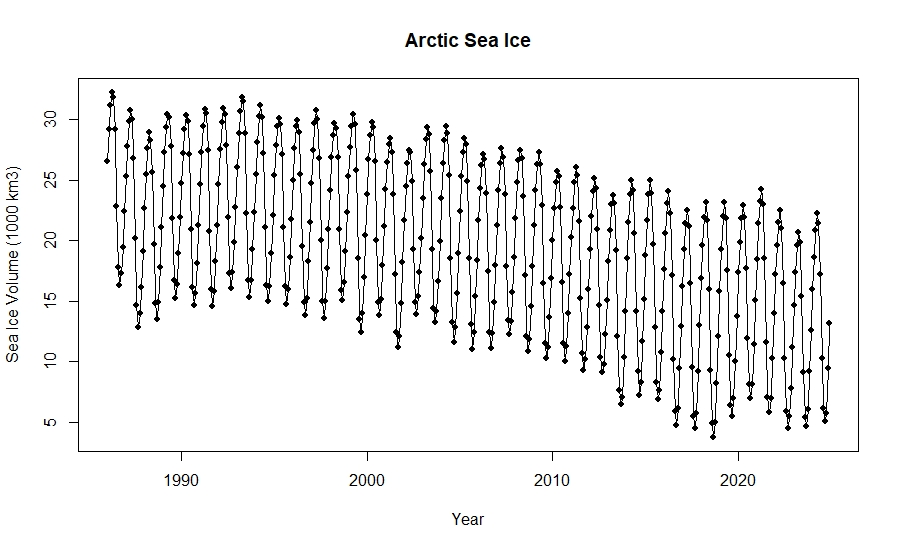
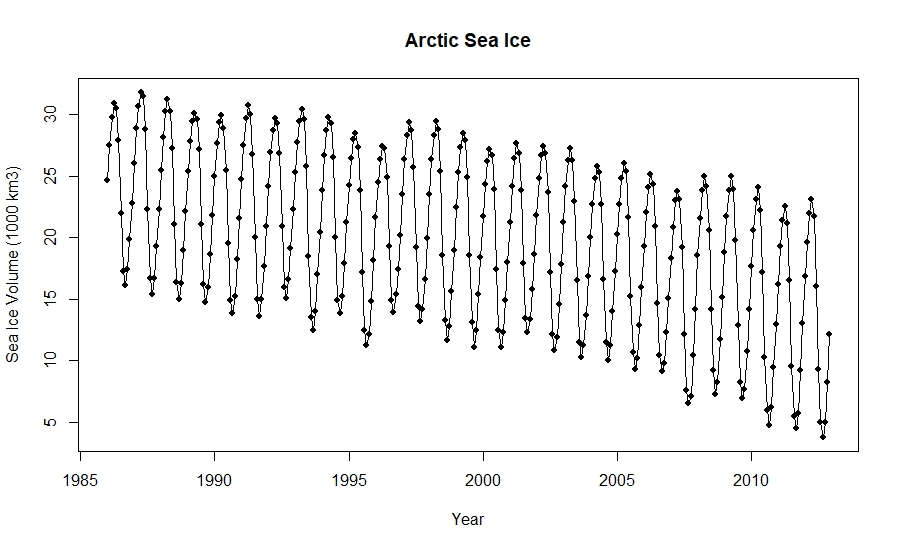
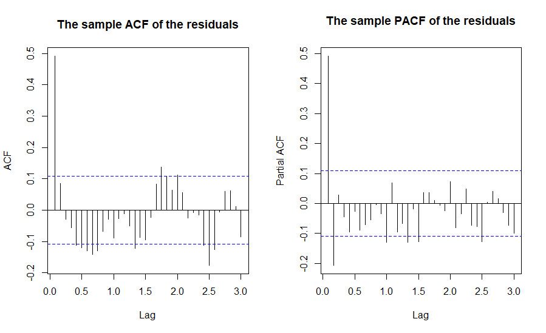

# 🧊 Arctic Sea Ice Forecast 📈



## 🌎 Background

The Arctic is warming at a rate nearly twice the global average, causing dramatic changes in sea ice coverage and thickness. Declining Arctic sea ice is one of the most visible indicators of climate change, with profound impacts on global weather patterns, polar ecosystems, and indigenous communities.

This project aims to analyze and forecast Arctic sea ice extent using time series modeling and data science tools. Accurate forecasting is essential for understanding climate trends, supporting environmental policy, and informing future research.

## 📁 Repository Structure

- `Assign2.R`, `GroupShared.R`: R scripts for analysis and forecasting.
- `Assignment3_TS.Rmd`, `iceForecast.Rmd`: RMarkdown documents for reporting and reproducible research.
- `data/`: Contains raw and processed datasets.
- `images/`: Contains visualization figures and results.
- `final report/`: Project report and results.

## 🖼️ Example Visualizations

Below are some example outputs from the forecasting analysis:


*Original time series of Arctic sea ice extent.*


*Processed/truncated data for analysis.*


*Forecast results generated by the model.*

_For more figures and outputs, browse the [images folder](https://github.com/capgalea/artic_sea_ice_forecast/tree/main/images)._

## 🚀 How to Run

1. **Clone this repository:**
   ```bash
   git clone https://github.com/capgalea/artic_sea_ice_forecast.git
   cd artic_sea_ice_forecast
   ```

2. **Open the Project in RStudio:**
   - Open `artic_sea_ice_forecast.Rproj`.

3. **Install Dependencies:**
   - Open any of the R scripts (`Assign2.R`, `GroupShared.R`, or `iceForecast.Rmd`) and install required packages if prompted, e.g.:
     ```r
     install.packages(c("tidyverse", "forecast", "lubridate", "readr", "ggplot2"))
     ```

4. **Run Analysis:**
   - To run the full analysis, knit the RMarkdown files (`iceForecast.Rmd`, `Assignment3_TS.Rmd`) in RStudio or run the scripts directly.

5. **View Outputs:**
   - Visualizations and results will be saved in the `images/` folder or displayed in the RMarkdown HTML output.

## 📝 Notes

- Data files are located in the `data/` directory. Please ensure you have all data files required for the scripts.
- Modify paths if running outside the project root.

## 🧑‍💻 Author

- **capgalea**  
  [GitHub Profile](https://github.com/capgalea)

## 📜 License

This project is licensed under the MIT License:

```
MIT License

Copyright (c) 2025 capgalea

Permission is hereby granted, free of charge, to any person obtaining a copy
of this software and associated documentation files (the "Software"), to deal
in the Software without restriction, including without limitation the rights
to use, copy, modify, merge, publish, distribute, sublicense, and/or sell
copies of the Software, and to permit persons to whom the Software is
furnished to do so, subject to the following conditions:

The above copyright notice and this permission notice shall be included in all
copies or substantial portions of the Software.

THE SOFTWARE IS PROVIDED "AS IS", WITHOUT WARRANTY OF ANY KIND, EXPRESS OR
IMPLIED, INCLUDING BUT NOT LIMITED TO THE WARRANTIES OF MERCHANTABILITY,
FITNESS FOR A PARTICULAR PURPOSE AND NONINFRINGEMENT. IN NO EVENT SHALL THE
AUTHORS OR COPYRIGHT HOLDERS BE LIABLE FOR ANY CLAIM, DAMAGES OR OTHER
LIABILITY, WHETHER IN AN ACTION OF CONTRACT, TORT OR OTHERWISE, ARISING FROM,
OUT OF OR IN CONNECTION WITH THE SOFTWARE OR THE USE OR OTHER DEALINGS IN THE
SOFTWARE.
```

---

*🌟 Contributions welcome! Please open issues or pull requests for improvements.*
